# Logistic-Regression-from-scratch
Numpy implementation of Logistic Regression (w/o explicit ML libraries, such as Pytorch or Tensorflow)

## What is Logistic Regression
### Logistic Function
- also called as <b>Sigmoid Function</b></li>
- $y$ = $1 \over 1+e^{-x}$
</img>
- Output of logistic function is always in (0,1)  ==> Logistic function satisfies the condition of <b>Probability Density Function</b>

### Odds ( $\ne$ Probability)
- defined as 'probability that the event will occur divied by the probability that the event will not occur <br>
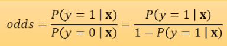</img>
</img>

### Mapping the linear equation f(x) to log odds
- In Linear Regression, $f(x) = W^TX$
- Let p = P(y=1|x)<br>
 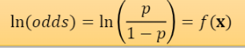</img>
- Take exponents for both side:<br>
 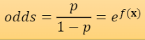</img>
- Then, p (the probability of y=1 for x) is <br>
 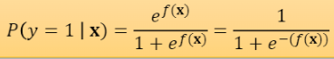</img>

## Loss Function Formulation : E( $W$ )
- Simply, use the loss function used in <b>Linear Regression</b> (Least Squares Error)<br>
 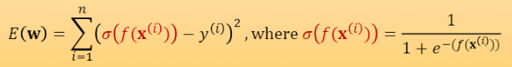</img><br>
- This gives <b>non-convex function</b> for w, which does not guarantee global minimum
- This if we use <b>Least Squares Error</b> for Gradient Descent Method, it is highly likely that the function converges in one of local minimums
- <b>So we don't use Least Squares Error for Logistic Regression</b>
- Then, we derive Loss Function from <b>Maximum Likelihood Estimation</b>
- Just like finding $\Theta$ that maximizes $\Sigma$ P(x| $\Theta$ )<br>
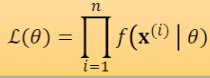</img>
- Find $w$ that maximizes <br>
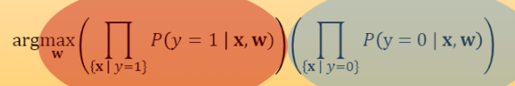</img>
- Then, by applying log each side and combining sigma : <br>
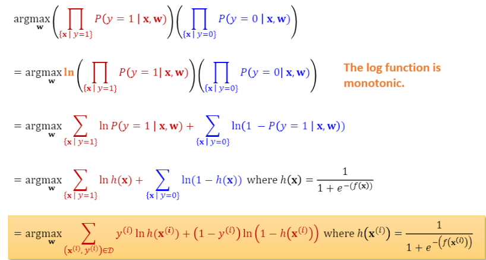</img>
- In the end, the Loss Function can be shown as <br>
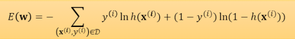</img>

## Computing Gradients (Computing Partial Derivatives) -details
#### Solve one by one using Chain Rule
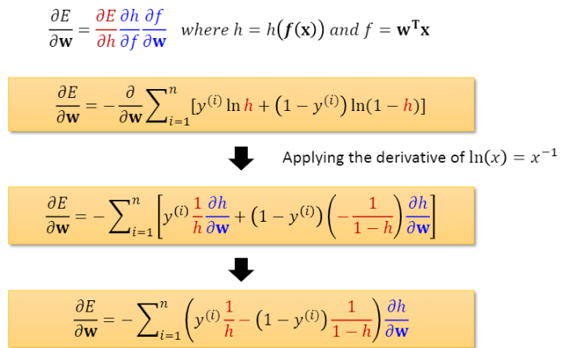</img><br>

#### Apply derivative of h (logistic function)
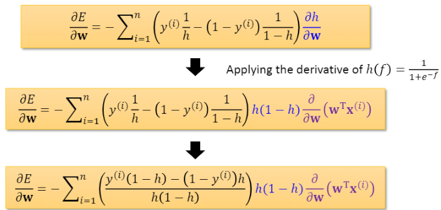</img><br>

#### Apply derivative of f (linear equation)
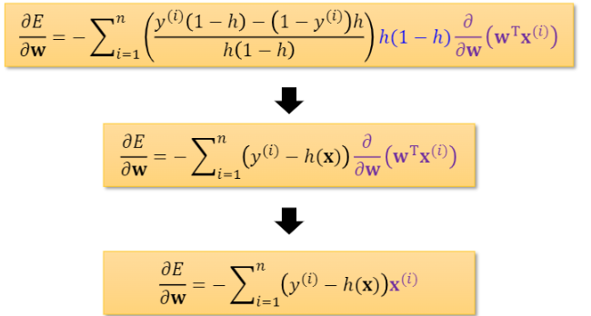</img><br><br>

### Final Gradient Form
</img><br><br>

### Python Code for Computing Gradient
```python
        def compute_grad(self, x, y, weight, logit):
        """
        N : # of minibatch data
        D : # of features

        Inputs:
        x : (N, D), input data
        y : (N, ), label for each data
        weight : (D, 1), Weight matrix of classifier
        logit: (N, 1), logits for N data

        Returns:
        gradient of weight: (D, 1), Gradient of weight to be applied (dL/dW)

        Description:
        Given input, label, weight, logit, compute gradient of weight.
        """

        num_data, num_feat = x.shape
        
        y = np.expand_dims(y, axis=1)

        grad_weight = np.zeros_like(weight)

        score = np.dot(x,self.W)
        score = self._sigmoid(score)
        temp = (score -y).reshape(1,-1)
        grad_weight = (1/num_data)*np.dot(temp,x)
        grad_weight = grad_weight.reshape(-1,1)

        return grad_weight
```

## Multinomail Logistic Regression
#### Use Softmax function instead of Logistic (Sigmoid) function


## Sample Datase
#### Breast Cancer - for Logistic Regression (binary classes)
</img>
#### EMNIST - for SoftmaxClassifier (more than two classes)
</img>

## Reference
SungKyunKwan University, College of Computing
